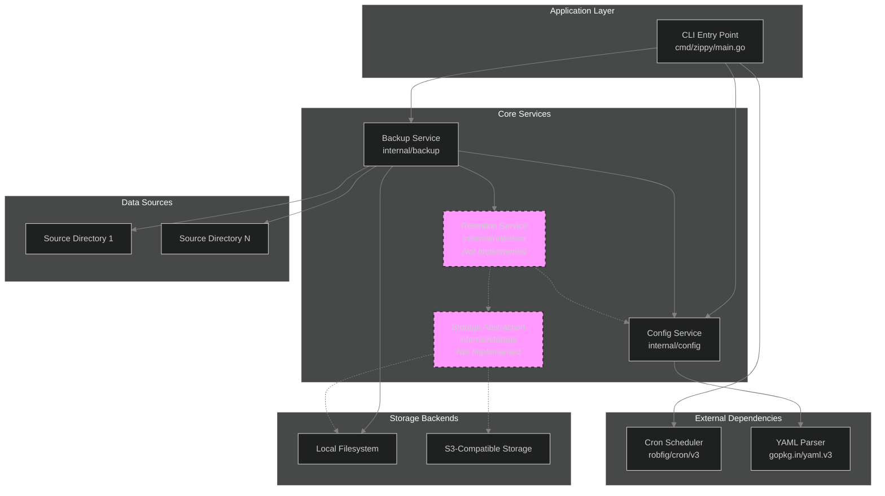
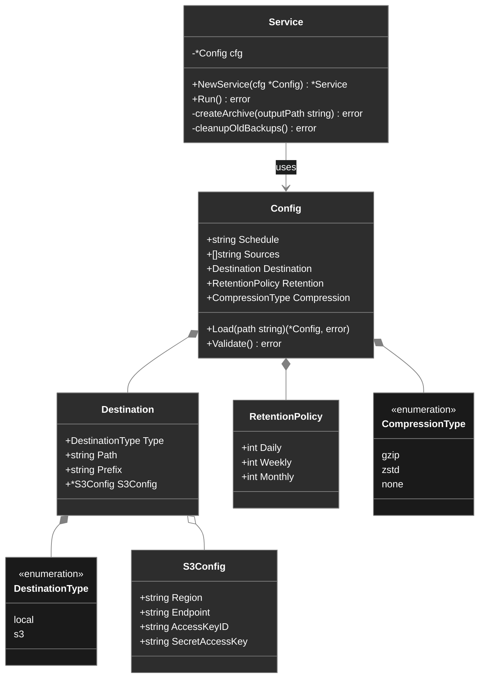
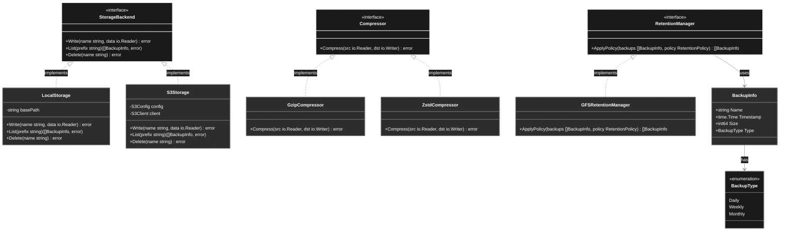
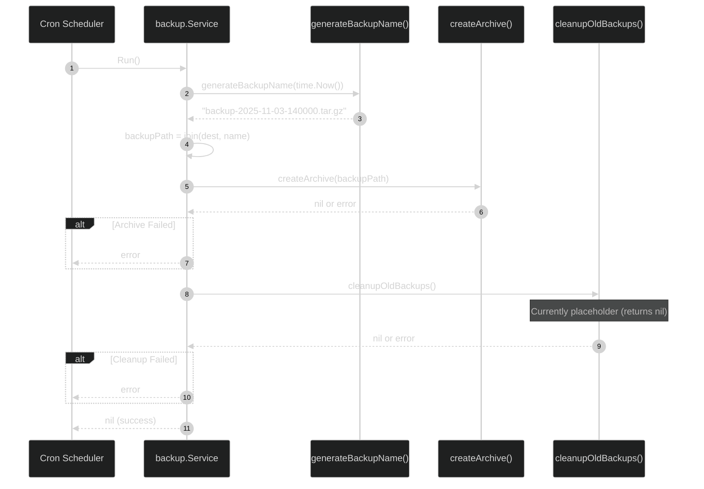
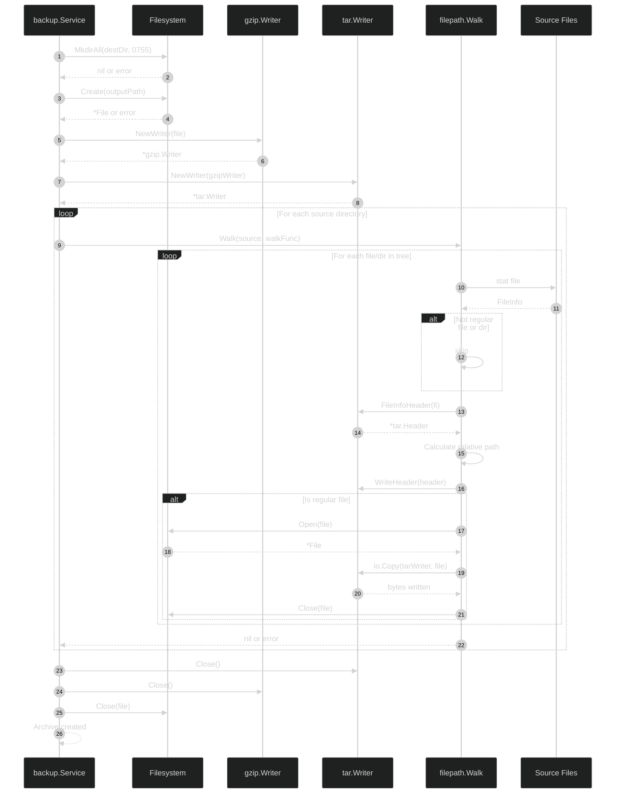
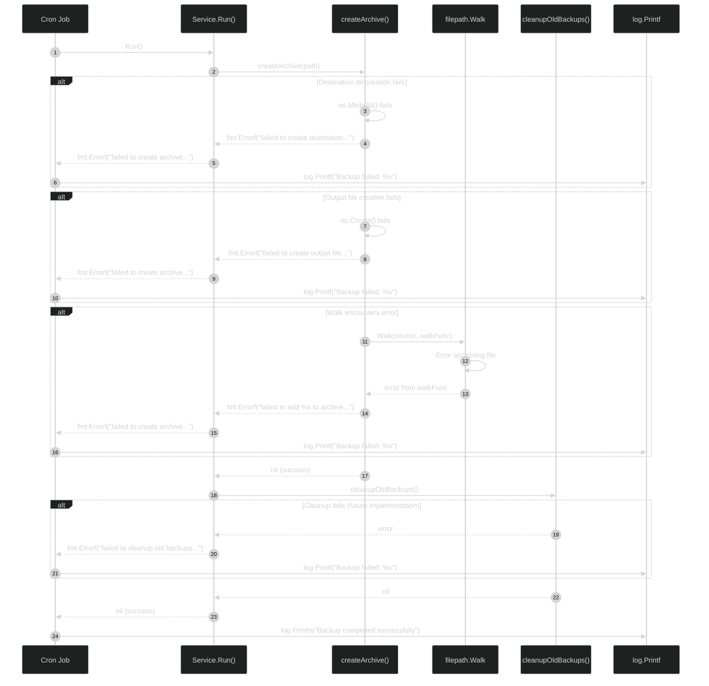
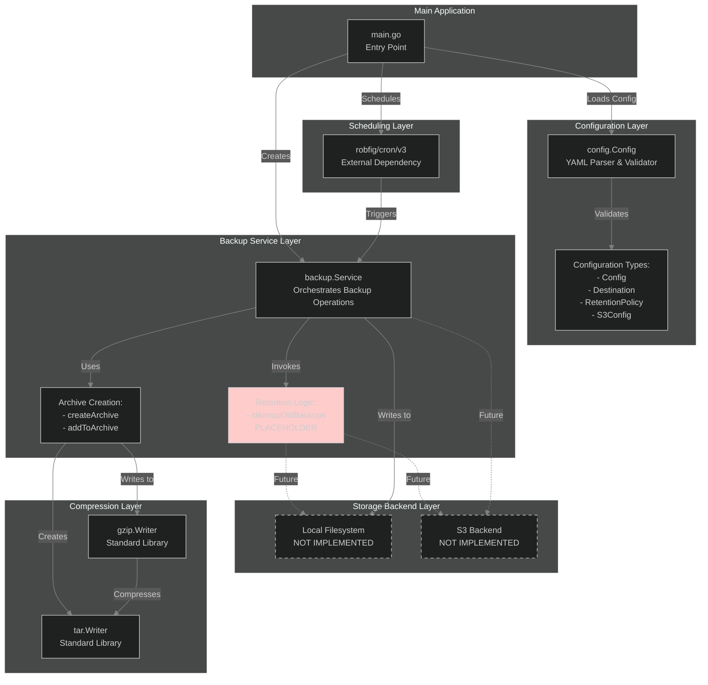

# Zippy Backup Tool - Repository Analysis

**Generated**: 2025-11-03
**Repository**: zippy
**Analysis Version**: 1.0

---

## Table of Contents

1. [Repository Overview](#1-repository-overview)
2. [Project Structure Analysis](#2-project-structure-analysis)
3. [High-Level Architecture Diagram](#3-high-level-architecture-diagram)
4. [Module/Component Analysis](#4-modulecomponent-analysis)
5. [Interface/Abstraction Hierarchy](#5-interfaceabstraction-hierarchy)
6. [Data Flow and Sequence Diagrams](#6-data-flow-and-sequence-diagrams)
7. [Module Interaction Map](#7-module-interaction-map)
8. [Database/Storage Schema](#8-databasestorage-schema)
9. [API Documentation](#9-api-documentation)
10. [Key Algorithms and Business Logic](#10-key-algorithms-and-business-logic)
11. [Testing Strategy](#11-testing-strategy)
12. [Security Considerations](#12-security-considerations)
13. [Performance and Scalability](#13-performance-and-scalability)
14. [Development Workflow](#14-development-workflow)
15. [Technical Debt and Improvement Areas](#15-technical-debt-and-improvement-areas)

---

## 1. Repository Overview

### Project Purpose

Zippy is a config-driven backup tool designed to run as sidecar containers in Docker and Kubernetes environments. It provides simple, full-archive backups of source directories to destination storage with Grandfather-Father-Son (GFS) retention policies and cron-based scheduling.

**Key Characteristics**:
- Simple backup tool with no incremental backup support
- Full archive approach: creates compressed tar archives
- Config-driven GFS retention policy
- Built for containerized environments (Docker/Kubernetes sidecars)
- Cron-based scheduling for automated backups

### Primary Programming Languages

- **Go 1.25.3** - Primary implementation language
- **YAML** - Configuration format
- **Dockerfile** - Container build configuration

### Core Frameworks & Technologies

| Technology | Version | Purpose |
|-----------|---------|---------|
| `github.com/robfig/cron/v3` | v3.0.1 | Cron-based scheduling for automated backups |
| `gopkg.in/yaml.v3` | v3.0.1 | YAML configuration parsing |
| Go Standard Library | - | archive/tar, compress/gzip, file I/O |
| Alpine Linux | latest | Minimal container base image |
| Docker | - | Containerization platform |

### Key Dependencies

**Direct Dependencies** (from `go.mod`):
```go
module zippy

go 1.25.3

require (
    github.com/robfig/cron/v3 v3.0.1
    gopkg.in/yaml.v3 v3.0.1
)
```

**Build Infrastructure**:
- Multi-stage Docker build using `golang:1.25-alpine` builder
- Static binary compilation with `CGO_ENABLED=0`
- Alpine Linux runtime for minimal container footprint
- Git for version injection during builds

### Domain and Target Users

**Domain**:
- Infrastructure/DevOps - Backup and disaster recovery
- Container orchestration - Sidecar pattern for Kubernetes/Docker
- Data protection - Archive and retention management

**Target Users**:
- DevOps engineers running containerized workloads
- Kubernetes cluster administrators
- Docker Compose users needing simple backup solutions
- Teams requiring Grandfather-Father-Son retention policies
- Organizations using S3-compatible object storage

**Use Cases**:
- Backing up application data in Kubernetes pods
- Protecting persistent volume data
- Automated database backups via sidecar pattern
- Multi-source directory archival with retention management

---

## 2. Project Structure Analysis

### Directory Structure

```
/home/dee/lab-workspace/zippy/
├── cmd/
│   └── zippy/                    # Application entry point
│       └── main.go               # Main executable with CLI flags
├── internal/
│   ├── backup/                   # Core backup implementation
│   │   └── backup.go             # Backup service, tar/gzip archival
│   ├── config/                   # Configuration management
│   │   ├── config.go             # YAML config structs and validation
│   │   └── config_test.go        # Config validation tests
│   ├── retention/                # Retention policy (empty - planned)
│   └── storage/                  # Storage abstraction (empty - planned)
├── configs/                      # Example configurations
│   ├── docker-compose.yaml       # Docker Compose sidecar example
│   ├── example-local.yaml        # Local filesystem backup config
│   ├── example-s3.yaml           # S3 storage backup config
│   └── kubernetes-example.yaml   # Kubernetes deployment manifest
├── docs/
│   └── project.md                # Development documentation
├── Dockerfile                    # Multi-stage Alpine-based build
├── .dockerignore                 # Docker build exclusions
├── .gitignore                    # Git exclusions
├── go.mod                        # Go module definition
├── go.sum                        # Dependency checksums
├── README.md                     # User documentation
├── AGENTS.md                     # Agent/LLM instructions
├── CLAUDE.md                     # Project-specific Claude instructions
└── LICENSE                       # MIT license
```

### Configuration Files

#### YAML Configuration Structure

**Local Backup Example** (`configs/example-local.yaml`):
```yaml
schedule: "0 2 * * *"
sources:
  - /data
  - /app/config
destination:
  type: local
  path: /backups
  prefix: backup-
retention:
  daily: 7
  weekly: 4
  monthly: 12
compression: gzip
```

**S3 Backup Example** (`configs/example-s3.yaml`):
```yaml
schedule: "0 2 * * *"
sources:
  - /data
destination:
  type: s3
  path: my-backup-bucket
  prefix: backups/
  s3:
    region: us-east-1
    endpoint: https://s3.amazonaws.com
    access_key_id: YOUR_ACCESS_KEY
    secret_access_key: YOUR_SECRET_KEY
retention:
  daily: 7
  weekly: 4
  monthly: 12
compression: gzip
```

#### Configuration Types (`internal/config/config.go`)

- **Config** - Main configuration structure
- **Destination** - Storage destination (local/s3)
- **S3Config** - S3-specific settings (region, endpoint, credentials)
- **RetentionPolicy** - GFS retention (daily, weekly, monthly counts)
- **CompressionType** - gzip, zstd, none (enumeration)
- **DestinationType** - local, s3 (enumeration)

### Entry Points

#### Main Application (`cmd/zippy/main.go`)

**Command-line flags**:
- `-config string` - Path to config file (default: "config.yaml")
- `-once` - Run backup once and exit (testing mode)

**Execution modes**:
1. **Scheduled mode**: Runs on cron schedule (default)
2. **One-shot mode**: Single backup execution with `-once` flag

**Key functionality**:
- Loads YAML config via `config.Load()`
- Creates `backup.Service` instance
- Sets up cron scheduler with `robfig/cron/v3`
- Handles SIGTERM/SIGINT for graceful shutdown
- Logs schedule, sources, destination on startup

#### Backup Service (`internal/backup/backup.go`)

```go
type Service struct {
    cfg *config.Config
}

// Core methods
Run()                         // Executes backup + cleanup
createArchive(outputPath)     // Creates tar.gz archive
addToArchive(tw, sourcePath)  // Recursively adds files/dirs
cleanupOldBackups()           // Retention policy (TODO)
generateBackupName(t)         // Timestamp-based naming
```

**Backup file naming pattern**:
```
backup-2006-01-02-150405.tar.gz
```

### Build & Deployment Configurations

#### Dockerfile

**Multi-stage build**:

```dockerfile
# Stage 1: Builder (golang:1.25-alpine)
- Installs git, ca-certificates, tzdata
- Downloads Go modules
- Builds static binary with CGO_ENABLED=0
- Embeds version from git describe

# Stage 2: Runtime (alpine:latest)
- Installs ca-certificates, tzdata
- Creates non-root user zippy:zippy (UID/GID 1000)
- Creates /data and /backups directories
- Runs as non-root user
- Default CMD: -config /app/config.yaml
```

**Security features**:
- Non-root user execution
- Static binary (no dynamic dependencies)
- Minimal Alpine base image

#### Docker Compose (`configs/docker-compose.yaml`)

```yaml
services:
  app:
    # Main application with data volume
  zippy:
    image: zippy:latest
    volumes:
      - app-data:/data:ro         # Read-only source
      - backups:/backups          # Backup destination
      - ./config.yaml:/app/config.yaml:ro
    restart: unless-stopped
```

#### Kubernetes (`configs/kubernetes-example.yaml`)

```yaml
# ConfigMap for zippy configuration
apiVersion: v1
kind: ConfigMap
metadata:
  name: zippy-config

# Deployment with sidecar pattern
spec:
  containers:
  - name: app                   # Main container
  - name: zippy                 # Backup sidecar
    volumeMounts:
    - name: data                # Read-only app data
      readOnly: true
    - name: backups             # Backup PVC
    - name: config              # ConfigMap mount

# PVCs for data and backups
```

### Implementation Status

#### Implemented ✅
- YAML configuration loading and validation
- Cron-based scheduling
- Tar/gzip archive creation
- Recursive directory archival
- Multi-source backup
- Local filesystem destination
- Docker containerization
- Configuration tests (`config_test.go`)

#### Planned/TODO ⏳
- Retention policy cleanup (`internal/retention/` empty)
- S3 storage backend (`internal/storage/` empty)
- Zstd compression support
- Metrics and monitoring
- Backup encryption
- Incremental backups
- Restore functionality

---

## 3. High-Level Architecture Diagram



### Component Layers

**Layer 1: Application Entry Point**
- **Component**: `cmd/zippy/main.go`
- **Responsibility**: CLI, scheduling, process lifecycle
- **Pattern**: Main-Service separation

**Layer 2: Business Logic Services**
- **Components**: `internal/backup`, `internal/retention`
- **Responsibility**: Core backup and retention operations
- **Pattern**: Service-oriented architecture

**Layer 3: Infrastructure Services**
- **Components**: `internal/config`, `internal/storage`
- **Responsibility**: Configuration, storage abstraction
- **Pattern**: Infrastructure as reusable components

**Layer 4: External Systems**
- **Components**: Filesystem, S3, Cron library
- **Responsibility**: Persistence, scheduling primitives

### Key Architectural Patterns

**1. Hexagonal Architecture (Ports and Adapters)**
- Core business logic (backup, retention) isolated from infrastructure
- Storage abstraction allows swapping backends
- Configuration injection decouples setup from execution

**2. Service Layer Pattern**
- `backup.Service` encapsulates backup operations
- Services own dependencies via constructor injection
- Clean separation between orchestration (main) and execution (services)

**3. Factory Pattern**
- `config.Load()` creates validated config instances
- `backup.NewService()` constructs service with dependencies
- Planned: `storage.NewBackend()` for storage factory

**4. Strategy Pattern (Planned)**
- Storage backends implement common interface
- Compression algorithms selectable via configuration
- Enables runtime behavior selection

**5. Functional Programming Principles**
- Pure functions where possible (`generateBackupName`)
- Immutable configuration after loading
- Error handling via explicit return values
- Defer for resource cleanup (functional resource management)

---

## 4. Module/Component Analysis

### 4.1 Config Module (`internal/config`)

**Core Responsibility**:
- Configuration file parsing and validation
- YAML deserialization into strongly-typed Go structs
- Configuration schema definition for entire application

**Public Interfaces/APIs**:
```go
// Main configuration loading function
func Load(path string) (*Config, error)

// Validation method
func (c *Config) Validate() error

// Core configuration types
type Config struct {
    Schedule    string
    Sources     []string
    Destination Destination
    Retention   RetentionPolicy
    Compression CompressionType
}
```

**Dependencies**:
- External: `gopkg.in/yaml.v3` for YAML parsing
- Internal: None (leaf module)
- Standard library: `fmt`, `os`

**Design Patterns**:
- **Factory Pattern**: `Load()` function creates validated Config instances
- **Type-Safe Enums**: Uses typed constants for `DestinationType` and `CompressionType`
- **Validation Pattern**: Separate `Validate()` method ensures data integrity
- **Value Object Pattern**: Config structs are immutable after creation

**Key Implementation Details**:
- Supports two destination types: local filesystem and S3-compatible storage
- Three compression algorithms: gzip, zstd, none
- Grandfather-Father-Son retention policy configuration
- Comprehensive validation with descriptive error messages
- Extensive test coverage (11 test cases covering valid/invalid scenarios)

### 4.2 Backup Module (`internal/backup`)

**Core Responsibility**:
- Core backup execution logic
- Creating compressed tar archives from source directories
- Orchestrating backup workflow (archive creation + cleanup)

**Public Interfaces/APIs**:
```go
// Service encapsulates backup operations
type Service struct {
    cfg *config.Config
}

// Constructor
func NewService(cfg *config.Config) *Service

// Main backup execution
func (s *Service) Run() error
```

**Dependencies**:
- Internal: `zippy/internal/config` for configuration
- Standard library: `archive/tar`, `compress/gzip`, `io`, `os`, `path/filepath`, `time`

**Design Patterns**:
- **Service Pattern**: Encapsulates backup logic in a service struct
- **Dependency Injection**: Config injected via constructor
- **Template Method**: `Run()` orchestrates high-level workflow
- **Visitor Pattern**: `filepath.Walk` for recursive directory traversal
- **Resource Management**: Deferred cleanup of file handles, writers

**Key Implementation Details**:
- Recursive directory archiving preserving structure
- Relative paths in archives for portability
- Timestamp-based backup naming: `backup-2006-01-02-150405.tar.gz`
- Currently only implements gzip compression (hardcoded)
- Cleanup logic stubbed out (placeholder for retention integration)
- Defensive error handling with wrapped errors
- Skips non-regular files and directories

**Current Limitations**:
- Compression type not configurable (ignores config)
- No progress reporting
- No partial backup recovery
- Retention cleanup not implemented

### 4.3 Retention Module (`internal/retention`)

**Current Status**: **Not Yet Implemented**

**Planned Responsibility**:
- Implement Grandfather-Father-Son retention policy
- Analyze existing backups and determine which to keep/delete
- Categorize backups into daily, weekly, monthly buckets
- Execute cleanup operations

**Expected Public Interfaces**:
```go
// Expected API (not yet implemented)
type Service interface {
    ApplyRetention(backupDir string, policy config.RetentionPolicy) error
    ListBackupsToDelete(backupDir string, policy config.RetentionPolicy) ([]string, error)
}
```

**Expected Dependencies**:
- Internal: `zippy/internal/config` for retention policy
- Internal: `zippy/internal/storage` for backend abstraction
- Standard library: `time`, `sort`, `os`

**Design Considerations**:
- Must parse backup filenames to extract timestamps
- Categorize by time period (daily/weekly/monthly)
- Sort by date and apply retention counts
- Handle edge cases (incomplete backups, corrupted files)

### 4.4 Storage Module (`internal/storage`)

**Current Status**: **Not Yet Implemented**

**Planned Responsibility**:
- Abstract storage backend operations (local filesystem, S3, etc.)
- Provide unified interface for backup storage/retrieval
- Handle authentication and connection management
- Support multiple storage backends

**Expected Public Interfaces**:
```go
// Expected API (not yet implemented)
type Backend interface {
    Write(ctx context.Context, name string, data io.Reader) error
    Read(ctx context.Context, name string) (io.ReadCloser, error)
    List(ctx context.Context, prefix string) ([]FileInfo, error)
    Delete(ctx context.Context, name string) error
}

// Factory function
func NewBackend(cfg config.Destination) (Backend, error)
```

**Expected Dependencies**:
- Internal: `zippy/internal/config` for destination configuration
- External: AWS SDK for S3 operations
- Standard library: `context`, `io`, `os`

**Design Patterns**:
- **Strategy Pattern**: Different storage backends implement common interface
- **Factory Pattern**: Backend selection based on configuration
- **Adapter Pattern**: Wrap vendor-specific SDKs with common interface

**Expected Implementations**:
- LocalBackend: Direct filesystem operations
- S3Backend: AWS S3 or compatible object storage
- Future: GCS, Azure Blob, etc.

### 4.5 Main Application (`cmd/zippy`)

**Core Responsibility**:
- Application entry point and CLI interface
- Cron scheduler setup and management
- Graceful shutdown handling
- Command-line flag parsing

**Public Interfaces**:
- Command-line flags:
  - `-config`: Path to configuration file (default: `config.yaml`)
  - `-once`: Run backup once and exit (testing mode)

**Dependencies**:
- External: `github.com/robfig/cron/v3` for scheduling
- Internal: `zippy/internal/backup`, `zippy/internal/config`
- Standard library: `flag`, `log`, `os`, `os/signal`, `syscall`

**Design Patterns**:
- **Facade Pattern**: Simple interface to complex backup subsystem
- **Observer Pattern**: Signal handling for graceful shutdown
- **Command Pattern**: Backup execution wrapped in cron jobs

**Key Implementation Details**:
- Two operational modes: daemon (scheduled) and one-shot
- Uses standard cron expressions for scheduling
- Graceful shutdown on SIGTERM/SIGINT
- Version injection via build-time ldflags
- Structured logging for operational visibility
- Error handling prevents crashes, logs failures

---

## 5. Interface/Abstraction Hierarchy

### Current Architecture

The codebase currently has a **simple, concrete implementation** without abstraction layers:



### Recommended Interface Architecture

For future extensibility, consider interfaces for storage backends and compression:



### Key Observations

**Current State**:
- No abstraction layer - all concrete implementations
- `Service` directly depends on `Config` struct
- Storage logic hardcoded in `Service.createArchive()`
- Retention cleanup is placeholder (`cleanupOldBackups()` returns nil)
- Only gzip compression implemented

**Missing Abstractions**:
- No `StorageBackend` interface (local vs S3)
- No `Compressor` interface (gzip, zstd, none)
- No `RetentionManager` interface (GFS policy)
- No `Archiver` interface (tar operations)

---

## 6. Data Flow and Sequence Diagrams

### 6.1 Application Startup and Scheduling

```mermaid
%%{init: {'theme':'dark', 'themeVariables': {'darkMode': true, 'background': '#000000', 'primaryColor': '#2d2d2d', 'primaryTextColor': '#ffffff', 'primaryBorderColor': '#4d4d4d', 'lineColor': '#808080', 'secondaryColor': '#1a1a1a', 'tertiaryColor': '#333333', 'fontSize': '14px'}}}%%
sequenceDiagram
    autonumber
    participant Main as main()
    participant Config as config.Load()
    participant FS as Filesystem
    participant YAML as yaml.Unmarshal()
    participant Validator as Config.Validate()
    participant Service as backup.Service
    participant Cron as cron.Cron
    participant Signal as OS Signals

    Main->>Config: Load(configPath)
    Config->>FS: os.ReadFile(path)
    FS-->>Config: config bytes
    Config->>YAML: Unmarshal(data)
    YAML-->>Config: Config struct
    Config->>Validator: Validate()
    Validator-->>Validator: Check schedule, sources, destination
    Validator-->>Config: nil or error
    Config-->>Main: *Config or error

    alt Config Load Failed
        Main->>Main: log.Fatalf()
    end

    Main->>Service: NewService(cfg)
    Service-->>Main: *Service

    alt Run Once Mode
        Main->>Service: Run()
        Service-->>Main: error or nil
        Main->>Main: exit
    end

    Main->>Cron: New()
    Cron-->>Main: *Cron
    Main->>Cron: AddFunc(schedule, func)
    Cron-->>Main: EntryID or error
    Main->>Cron: Start()
    Cron->>Cron: Start background goroutine

    Main->>Signal: signal.Notify(SIGINT, SIGTERM)
    Main->>Main: Wait for signal
    Signal-->>Main: Interrupt signal received
    Main->>Cron: Stop()
    Main->>Main: exit

    rect rgb(26, 26, 26)
        Note over Cron: Background Cron Loop
        loop Every schedule tick
            Cron->>Service: Run()
            Note over Service: Execute backup
            Service-->>Cron: nil or error
        end
    end
```



### 6.2 Backup Execution Flow



### 6.3 Archive Creation and Compression



### 6.4 Configuration Loading Flow

```mermaid
%%{init: {'theme':'dark', 'themeVariables': {'darkMode': true, 'background': '#000000', 'primaryColor': '#2d2d2d', 'primaryTextColor': '#ffffff', 'primaryBorderColor': '#4d4d4d', 'lineColor': '#808080', 'secondaryColor': '#1a1a1a', 'tertiaryColor': '#333333', 'fontSize': '14px'}}}%%
sequenceDiagram
    autonumber
    participant Main as main()
    participant Loader as config.Load()
    participant FS as os.ReadFile()
    participant YAML as yaml.Unmarshal()
    participant Val as Config.Validate()

    Main->>Loader: Load(configPath)
    Loader->>FS: ReadFile(path)

    alt File not found
        FS-->>Loader: error
        Loader-->>Main: nil, error
    end

    FS-->>Loader: []byte (YAML data)
    Loader->>YAML: Unmarshal(data, &cfg)

    alt Invalid YAML
        YAML-->>Loader: error
        Loader-->>Main: nil, error
    end

    YAML-->>Loader: Config struct populated

    Loader->>Val: cfg.Validate()

    rect rgb(26, 26, 26)
        Note over Val: Validation Checks
        Val->>Val: Check schedule not empty
        Val->>Val: Check sources not empty
        Val->>Val: Check destination type set
        Val->>Val: Check destination path set
        Val->>Val: Check dest type is local or s3

        alt Destination is S3
            Val->>Val: Check S3Config not nil
        end

        Val->>Val: Check retention values >= 0
    end

    alt Validation failed
        Val-->>Loader: error
        Loader-->>Main: nil, error
    end

    Val-->>Loader: nil (valid)
    Loader-->>Main: *Config, nil
```



### 6.5 Retention Policy Cleanup Flow (Planned)

```mermaid
%%{init: {'theme':'dark', 'themeVariables': {'darkMode': true, 'background': '#000000', 'primaryColor': '#2d2d2d', 'primaryTextColor': '#ffffff', 'primaryBorderColor': '#4d4d4d', 'lineColor': '#808080', 'secondaryColor': '#1a1a1a', 'tertiaryColor': '#333333', 'fontSize': '14px'}}}%%
sequenceDiagram
    autonumber
    participant Service as backup.Service
    participant Storage as StorageBackend
    participant Retention as RetentionManager
    participant GFS as GFS Algorithm

    Note over Service,GFS: Currently Not Implemented (placeholder)

    Service->>Storage: List(prefix)
    Storage-->>Service: []BackupInfo

    Service->>Service: Parse timestamps from names

    Service->>Retention: ApplyPolicy(backups, policy)

    rect rgb(26, 26, 26)
        Note over Retention,GFS: Grandfather-Father-Son Logic
        Retention->>GFS: Classify backups by type
        GFS->>GFS: Identify Daily backups (last 7)
        GFS->>GFS: Identify Weekly backups (last 4)
        GFS->>GFS: Identify Monthly backups (last 12)
        GFS->>GFS: Determine backups to keep
        GFS-->>Retention: backupsToKeep []BackupInfo
        Retention->>Retention: Calculate backupsToDelete
    end

    Retention-->>Service: backupsToDelete []BackupInfo

    loop For each backup to delete
        Service->>Storage: Delete(backup.Name)
        Storage-->>Service: nil or error
    end

    Service-->>Service: Cleanup complete
```



### 6.6 Error Handling Flow



---

## 7. Module Interaction Map



### API Boundaries

**Config Package API**:
```go
// Public exports
Load(path string) (*Config, error)
Validate() error

// Data structures
type Config struct {
    Schedule    string
    Sources     []string
    Destination Destination
    Retention   RetentionPolicy
    Compression CompressionType
}
```

**Backup Package API**:
```go
// Public exports
NewService(cfg *config.Config) *Service
Run() error

// Internal functions (unexported)
createArchive(outputPath string) error
addToArchive(tw *tar.Writer, sourcePath string) error
cleanupOldBackups() error
generateBackupName(t time.Time) string
```

### Shared Resources

- **File System**: Source directories (read-only), destination directory (write)
- **Configuration**: Immutable config loaded at startup, shared across scheduler and backup service
- **Cron Scheduler**: Single instance managing backup schedule
- **Archive Writer Chain**: `File -> gzip.Writer -> tar.Writer`

---

## 8. Database/Storage Schema

### Metadata Storage

**Current Approach**: NO database or separate metadata files. All backup information derived from:
- Filename timestamps: `backup-2025-11-03-020000.tar.gz`
- File modification times
- Directory listing

### Backup Naming Pattern

```
{destination.path}/{prefix}backup-{YYYY-MM-DD-HHMMSS}.tar.gz
```

**Examples**:
- `/backups/backup-2025-11-03-020000.tar.gz`
- `/backups/backup-backup-2025-11-03-020000.tar.gz` (with prefix)
- `s3://bucket/backups/backup-2025-11-03-020000.tar.gz`

### Archive Internal Structure

```
archive.tar.gz (root)
├── source1/
│   ├── file1.txt
│   └── subdir/
│       └── file2.txt
└── source2/
    └── data.db
```

Relative paths preserve source directory names but strip parent paths.

### Configuration Schema (YAML)

#### Full Schema Definition

```yaml
# Required: Cron schedule expression
schedule: string  # "0 2 * * *"

# Required: Source directories
sources:
  - string  # Absolute paths
  - string

# Required: Destination configuration
destination:
  type: string  # "local" | "s3"
  path: string  # Local path or S3 bucket
  prefix: string  # Optional filename prefix

  # Conditional: Required when type is "s3"
  s3:
    region: string  # AWS region
    endpoint: string  # Optional custom S3 endpoint
    access_key_id: string  # Optional (use IAM role)
    secret_access_key: string  # Optional (use IAM role)

# Required: GFS retention policy
retention:
  daily: int    # >= 0
  weekly: int   # >= 0
  monthly: int  # >= 0

# Optional: Compression algorithm
compression: string  # "gzip" | "zstd" | "none"
```

#### Go Type Mappings

```go
type Config struct {
    Schedule    string           `yaml:"schedule"`
    Sources     []string         `yaml:"sources"`
    Destination Destination      `yaml:"destination"`
    Retention   RetentionPolicy  `yaml:"retention"`
    Compression CompressionType  `yaml:"compression,omitempty"`
}

type Destination struct {
    Type     DestinationType  `yaml:"type"`
    Path     string           `yaml:"path"`
    Prefix   string           `yaml:"prefix,omitempty"`
    S3Config *S3Config        `yaml:"s3,omitempty"`
}

type S3Config struct {
    Region          string  `yaml:"region"`
    Endpoint        string  `yaml:"endpoint,omitempty"`
    AccessKeyID     string  `yaml:"access_key_id,omitempty"`
    SecretAccessKey string  `yaml:"secret_access_key,omitempty"`
}

type DestinationType string
const (
    DestinationLocal DestinationType = "local"
    DestinationS3    DestinationType = "s3"
)

type CompressionType string
const (
    CompressionGzip CompressionType = "gzip"
    CompressionZstd CompressionType = "zstd"
    CompressionNone CompressionType = "none"
)

type RetentionPolicy struct {
    Daily   int  `yaml:"daily"`
    Weekly  int  `yaml:"weekly"`
    Monthly int  `yaml:"monthly"`
}
```

### Storage Patterns

**Local Filesystem**:
- Direct file operations
- Path: `{destination.path}/{prefix}backup-{timestamp}.tar.gz`
- No authentication required

**S3-Compatible Storage** (Planned):
- Object storage with bucket/key structure
- Key: `{destination.prefix}backup-{timestamp}.tar.gz`
- Authentication: IAM role or static credentials
- Endpoint configurable for AWS S3, MinIO, DigitalOcean Spaces, etc.

---

## 9. API Documentation

### Overview

Zippy is a CLI-based tool with no HTTP/gRPC APIs. Configuration is YAML-based.

### Command Line Interface

**Binary**: `zippy`

**Flags**:
- `-config string` - Path to configuration file (default: `"config.yaml"`)
- `-once` - Run backup once and exit (default: `false`)

**Usage**:
```bash
# Run with default config
./zippy

# Run with custom config
./zippy -config /etc/zippy/config.yaml

# Run once (testing)
./zippy -config config.yaml -once
```

**Exit Codes**:
- `0`: Success
- `1`: Error

### Container Interface

**Docker Image**: `zippy:latest`

**Entry Point**: `/app/zippy`

**Default CMD**: `["-config", "/app/config.yaml"]`

**Expected Volumes**:
- `/data` - Source data (mount as `:ro`)
- `/backups` - Backup destination
- `/app/config.yaml` - Configuration file

**Example**:
```bash
docker run \
  -v /host/data:/data:ro \
  -v /host/backups:/backups \
  -v /host/config.yaml:/app/config.yaml:ro \
  zippy:latest
```

### Kubernetes Interface

**Sidecar Pattern**:
```yaml
containers:
- name: zippy
  image: zippy:latest
  args: ["-config", "/app/config.yaml"]
  volumeMounts:
  - name: data
    mountPath: /data
    readOnly: true
  - name: backups
    mountPath: /backups
  - name: config
    mountPath: /app
    readOnly: true
```

### Logging Interface

**Format**: Plaintext with timestamps

**Example Output**:
```
Zippy backup service (version: dev) starting...
Schedule: 0 2 * * *
Sources: [/data /app/config]
Destination: /backups (local)
Backup scheduler started. Waiting for scheduled runs...
Starting scheduled backup...
Backup completed successfully
```

### No REST/HTTP API

Zippy does not provide:
- HTTP endpoints
- Health checks
- Metrics endpoints
- Status API
- Webhooks

---

## 10. Key Algorithms and Business Logic

### 10.1 Archive Creation Algorithm

**Location**: `internal/backup/backup.go:46-74`

**Streaming Compression Pipeline**:
```
Source Files → filepath.Walk → tar.Writer → gzip.Writer → File
```

**Algorithm Flow**:
1. Create output file at destination
2. Setup compression chain (File → gzip → tar)
3. For each source, recursively walk filesystem
4. Stream files through pipeline without buffering
5. Close writers in reverse order (LIFO)

**Design Decision**: Streaming prevents memory issues with large files.

### 10.2 Recursive Directory Archiving

**Location**: `internal/backup/backup.go:76-120`

**Algorithm**:
1. Use `filepath.Walk` for recursive traversal
2. Skip non-regular files (symlinks, devices)
3. Create tar header with metadata
4. Calculate relative paths from source parent
5. Stream file contents via `io.Copy`

**Path Handling**: Stores relative paths preserving source directory names.

### 10.3 Backup Naming Convention

**Location**: `internal/backup/backup.go:130-132`

```go
func generateBackupName(t time.Time) string {
    return fmt.Sprintf("backup-%s.tar.gz", t.Format("2006-01-02-150405"))
}
```

**Format**: `backup-YYYY-MM-DD-HHMMSS.tar.gz`

**Example**: `backup-2025-11-03-020000.tar.gz`

### 10.4 Grandfather-Father-Son Retention (Planned)

**Location**: `internal/backup/backup.go:123-127`

**Status**: PLACEHOLDER - NOT IMPLEMENTED

**Expected Algorithm**:
1. List backups in destination
2. Parse timestamps from filenames
3. Categorize by time period:
   - **Daily**: Last N days
   - **Weekly**: N weekly backups
   - **Monthly**: N monthly backups
4. Mark excess backups for deletion
5. Delete via storage backend

### 10.5 Cron Scheduling

**Location**: `cmd/zippy/main.go:55-70`

**Implementation**: Uses `github.com/robfig/cron/v3`

**Cron Expression Examples**:
- `"0 2 * * *"` - Daily at 2:00 AM
- `"0 */6 * * *"` - Every 6 hours
- `"0 0 * * 0"` - Weekly on Sunday

**Behavior**:
- Single-threaded execution
- Errors logged but don't stop scheduler
- Runs until SIGTERM/SIGINT

### 10.6 Graceful Shutdown

**Location**: `cmd/zippy/main.go:73-80`

**Algorithm**:
1. Register signal handler (SIGINT, SIGTERM)
2. Block until signal received
3. Stop cron scheduler
4. Exit cleanly

**Note**: Running backup completes before shutdown.

### 10.7 Configuration Validation

**Location**: `internal/config/config.go:81-111`

**Validation Rules**:
- Schedule expression required (not validated for format)
- At least one source directory
- Destination type must be "local" or "s3"
- Destination path required
- S3 type requires S3Config
- Retention values must be non-negative

**Design**: Fail-fast at startup. Invalid config prevents daemon start.

---

## 11. Testing Strategy

### Test Structure

**Test Files**:
- `internal/config/config_test.go` - Unit tests for configuration

**Coverage**:
- Config package: ✅ Comprehensive (11 test cases)
- Backup package: ❌ No tests
- Main entry point: ❌ No tests
- Retention: ❌ Empty
- Storage: ❌ Empty

### Types of Tests

**Unit Tests** (Config Module):
```go
func TestConfigValidate(t *testing.T) {
    tests := []struct {
        name    string
        config  Config
        wantErr bool
    }{
        {
            name: "valid local config",
            config: Config{
                Schedule: "0 2 * * *",
                Sources:  []string{"/data"},
                Destination: Destination{
                    Type: DestinationLocal,
                    Path: "/backups",
                },
                Retention: RetentionPolicy{
                    Daily: 7, Weekly: 4, Monthly: 12,
                },
            },
            wantErr: false,
        },
        // ... 7 more test cases
    }
}
```

**Test Cases Coverage**:
1. Valid local destination config
2. Valid S3 destination config
3. Missing schedule error
4. Missing sources error
5. Missing destination type error
6. Invalid destination type error
7. S3 without config error
8. Negative retention values error
9. File loading success
10. Non-existent file error
11. Malformed YAML error

**Test Patterns**:
- Table-driven tests (Go best practice)
- Sub-tests with `t.Run()`
- Temporary directories (`t.TempDir()`)
- Error validation
- Real filesystem I/O

### Testing Tools

**Standard Library Only**:
- `testing` - Built-in Go testing
- No external frameworks (testify, ginkgo)

### Missing Test Coverage

**Critical Gaps**:
1. **Backup Package**: No tests for archive creation, directory walking, backup flow
2. **Main Entry Point**: No tests for cron, signals, run-once mode
3. **Integration Tests**: No end-to-end backup/restore tests
4. **Performance Tests**: No benchmarks

### Test Quality

**Strengths**:
- ✅ Defensive validation testing
- ✅ Table-driven tests
- ✅ Sub-tests for organization
- ✅ Error path testing
- ✅ Filesystem isolation

**Areas for Improvement**:
- ❌ No integration tests
- ❌ No test coverage reporting
- ❌ Missing backup functionality tests
- ❌ No mock interfaces
- ❌ No benchmark tests

---

## 12. Security Considerations

### Authentication and Authorization

**Object Storage**:
- Config allows hardcoded credentials (security concern)
- IAM role support mentioned but not implemented
- **Risk**: Credentials in config files

**File System Access**:
- No permission validation before backup
- Runs with container user permissions (UID 1000)
- Source directories mounted read-only (best practice)

### Data Validation

**Config Validation** (`internal/config/config.go:81-111`):
- ✅ Required field checks
- ✅ Enum validation
- ✅ Non-negative retention values
- ❌ No cron expression syntax validation
- ❌ No path validation/sanitization
- ❌ No injection attack prevention
- ❌ No limits on source count or path length

**Archive Creation**:
- No path traversal protection
- No file size validation (disk exhaustion risk)
- No symlink handling (could follow outside directories)
- No special file filtering

### Container Security

**Dockerfile** (`Dockerfile`):
- ✅ Non-root user (UID 1000)
- ✅ Multi-stage build
- ✅ Static binary
- ✅ Minimal Alpine base
- ❌ Uses `latest` tag (should pin)
- ❌ No resource limits

### Credential Handling

**Current State**:
- Credentials only in YAML config
- Config files in `.gitignore`
- No encryption at rest
- No secrets management integration
- No environment variable support

### Security Concerns

1. **Path Traversal**: No protection against malicious symlinks
2. **Resource Exhaustion**: No limits on backup size or memory
3. **Information Disclosure**: Logs may expose paths
4. **Credential Exposure**: Config readable by other processes
5. **Missing Validation**: Paths not validated for injection
6. **No Audit Logging**: No record of operations
7. **No Encryption**: Backups stored unencrypted
8. **No Integrity Checks**: No checksums or signatures

---

## 13. Performance and Scalability

### Performance Optimizations

**Current**:
- ✅ Static binary compilation
- ✅ Stripped binaries
- ✅ Alpine Linux base
- ✅ Multi-stage Docker build

**Missing**:
- ❌ No buffered I/O configuration
- ❌ No compression level tuning
- ❌ Sequential processing (single-threaded)
- ❌ No progress tracking
- ❌ No resumable backups

### Compression Strategies

**Current Implementation**:
- Only gzip implemented
- Hardcoded despite config supporting multiple types
- Uses default compression level
- No parallel compression

**Missing**:
- Zstd support
- Compression level configuration
- Parallel compression
- Skip already-compressed files

### Resource Management

**Memory**:
- No explicit limits
- Archive writer buffers in memory
- `filepath.Walk` loads entire tree
- File content copied with `io.Copy` (efficient but unbounded)

**File Handles**:
- ✅ Proper cleanup with `defer`
- One file open at a time during archiving
- No file handle pooling

**Disk I/O**:
- Sequential writes
- No buffering configuration
- No fsync control

### Concurrency

**Current State**:
- Completely synchronous
- No concurrency
- Single backup at a time
- No parallel file processing

**Opportunities**:
- Parallel file reading and compression
- Concurrent archiving of multiple sources
- Async retention cleanup
- Background S3 uploads
- Worker pool for file processing

### Scalability for Sidecar Deployment

**Limitations**:
1. Single source processing (serial)
2. No rate limiting
3. No backpressure
4. Memory growth with large directories
5. No sharding

**Sidecar Concerns**:
- Shares CPU/memory with main container
- No resource isolation
- Could impact application performance
- Network bandwidth competition
- Shared volume I/O contention

**Scalability Strengths**:
- Stateless design
- Each sidecar independent
- No central coordination
- Pod-level scaling
- Local backups don't need network

**Bottlenecks**:
1. **I/O Bound**: Disk read/write primary limit
2. **Compression CPU**: Single-threaded limits throughput
3. **Network Upload**: S3 uploads will be slow
4. **Memory**: Large files loaded entirely
5. **Walk Overhead**: Directory traversal for large trees

---

## 14. Development Workflow

### Build Process

**Local Build**:
```bash
go build -o zippy ./cmd/zippy
```

**Docker Build** (Multi-stage):
```dockerfile
# Stage 1: Builder
FROM golang:1.25-alpine AS builder
RUN CGO_ENABLED=0 GOOS=linux GOARCH=amd64 go build \
    -ldflags="-w -s -X main.version=$(git describe --tags)" \
    -o zippy ./cmd/zippy

# Stage 2: Runtime
FROM alpine:latest
COPY --from=builder /build/zippy /app/zippy
USER zippy:1000
```

**Build Features**:
- Two-stage for minimal size
- CGO disabled for static binary
- Version injection via git tags
- Strip symbols with `-ldflags="-w -s"`
- Non-root user

### Development Environment

**Prerequisites**:
- Go 1.25.3

**Dependencies**:
```bash
go mod download
```

### Code Style and Conventions

**Go Standards**:
1. **Package Organization**: `cmd/` for executables, `internal/` for private packages
2. **Naming**: PascalCase types, camelCase functions, lowercase private
3. **Error Handling**: Defensive wrapping with `fmt.Errorf`
4. **Type Safety**: Custom types for enums, no `any`
5. **Functional Patterns**: Pure functions, immutable config
6. **Resource Management**: Defer for cleanup

### Container Setup

**Docker Compose** (Sidecar):
```yaml
services:
  app:
    volumes:
      - app-data:/data
  zippy:
    image: zippy:latest
    volumes:
      - app-data:/data:ro
      - backups:/backups
      - ./config.yaml:/app/config.yaml:ro
```

**Kubernetes** (Sidecar):
```yaml
containers:
- name: zippy
  args: ["-config", "/app/config.yaml"]
  volumeMounts:
  - name: data
    mountPath: /data
    readOnly: true
  - name: backups
    mountPath: /backups
```

### CI/CD Configuration

**Current State**: ❌ None configured

**Recommended**:
- GitHub Actions for tests
- Automated builds on tags
- Container registry pushes
- Security scanning

### Development Commands

**Testing**:
```bash
go test ./...
go test -coverprofile=coverage.txt ./...
go test -race ./...
```

**Running**:
```bash
./zippy -config config.yaml -once
./zippy -config config.yaml
```

**Code Quality**:
```bash
go fmt ./...
go vet ./...
```

### Version Management

**Version Injection**:
```go
var version = "dev"  // Overridden at build time
```

Build command:
```bash
-ldflags="-X main.version=$(git describe --tags --always --dirty)"
```

---

## 15. Technical Debt and Improvement Areas

### Areas for Refactoring

**Incomplete Features**:
1. **Retention Policy** - Placeholder, critical GFS logic missing
2. **S3 Storage** - Empty package, no AWS SDK integration
3. **Compression Types** - Zstd and none defined but unused

**Code Structure**:
1. **Tight Coupling**: Backup service directly handles archiving
2. **Mixed Concerns**: Archive creation and business logic in same file
3. **No Interfaces**: Direct struct dependencies, hard to mock
4. **Error Context**: Lacks operational context (file names, sizes)

**Testing Gaps**:
1. No backup tests
2. No integration tests
3. No error path tests
4. No performance benchmarks
5. No mocks

### Missing Documentation

**Code Documentation**:
- No package-level doc comments
- Exported functions lack docs
- No usage examples
- Complex logic lacks inline comments

**Architecture Documentation**:
- No design documents
- No decision records
- Missing retention algorithm docs

**Operational Documentation**:
- No troubleshooting guide
- No performance tuning guide
- No security hardening guide
- No monitoring recommendations

### Potential Architectural Improvements

**1. Storage Abstraction**:
```go
type Storage interface {
    Write(ctx context.Context, name string, r io.Reader) error
    List(ctx context.Context) ([]BackupInfo, error)
    Delete(ctx context.Context, name string) error
}
```

**2. Compression Abstraction**:
```go
type Compressor interface {
    Wrap(w io.Writer) (io.WriteCloser, error)
}
```

**3. Context Propagation**:
- Add `context.Context` to operations
- Enable cancellation and timeouts
- Better observability

**4. Metrics and Observability**:
- Prometheus metrics
- Structured logging (JSON)
- Health check endpoints
- Readiness/liveness probes

**5. Backup Verification**:
- Checksum generation
- Integrity verification
- Restore verification

**6. Notification System**:
- Webhooks for events
- Email notifications
- Slack/Discord integration

### Outdated Patterns

**Go Version**:
- Using `go 1.25.3` (non-existent)
- Should update to stable latest

**Dependencies**:
- `robfig/cron/v3` stable (2019)
- `yaml.v3` stable
- Missing AWS SDK for S3
- Missing observability libraries

**Patterns**:
1. No `context.Context` usage
2. Printf logging instead of structured
3. Direct file I/O instead of `fs.FS`
4. `fmt.Errorf` instead of modern error patterns
5. No generics

**Container Patterns**:
- No distroless images
- No SBOM generation
- No image signing
- No vulnerability scanning
- No multi-architecture builds

### Priority Recommendations

**Critical** (Security/Functionality):
1. Implement retention policy
2. Add path traversal protection
3. Add resource limits
4. Implement S3 backend
5. Add env var credential support

**High** (Reliability/Testing):
1. Add comprehensive tests
2. Add integration tests
3. Implement context propagation
4. Add structured logging
5. Add metrics/observability

**Medium** (Architecture/Maintainability):
1. Create storage abstraction
2. Implement compression abstraction
3. Add package documentation
4. Create architecture diagrams
5. Add error recovery

**Low** (Nice-to-Have):
1. Add notification system
2. Add progress tracking
3. Add backup verification
4. Implement parallel processing
5. Add restore functionality

---

## Summary

### Implementation Status

| Component | Status | Notes |
|-----------|--------|-------|
| Configuration | ✅ Complete | YAML parsing, validation, comprehensive tests |
| Backup Service | 🟡 Partial | Archive creation works, cleanup stubbed |
| Retention Policy | ❌ Not Started | Empty package, critical feature missing |
| Storage Abstraction | ❌ Not Started | Empty package, S3 support missing |
| Compression | 🟡 Partial | Gzip only, config ignored |
| Testing | 🟡 Minimal | Config tests only |
| Documentation | 🟡 Basic | README exists, lacks depth |

### Key Strengths

1. **Clean Architecture**: Clear separation of concerns
2. **Type Safety**: Strong typing, no dangerous patterns
3. **Container-Ready**: Docker/Kubernetes first-class
4. **Defensive Programming**: Validation, error handling
5. **Functional Approach**: Minimal side effects
6. **Simple Design**: Easy to understand and maintain

### Major Gaps

1. **Incomplete Core Features**: Retention and S3 not implemented
2. **Limited Testing**: Only config module tested
3. **Missing Observability**: No metrics or structured logging
4. **Security Concerns**: Path traversal, credential handling
5. **No Concurrency**: Single-threaded, performance limitations
6. **Documentation**: Operational and architecture docs missing

### Recommended Next Steps

1. **Implement retention policy** (critical for production use)
2. **Add comprehensive tests** (backup, integration, e2e)
3. **Implement S3 storage backend** (extend use cases)
4. **Add security hardening** (path validation, credentials)
5. **Add observability** (metrics, structured logging, health checks)

---

**Document End**
